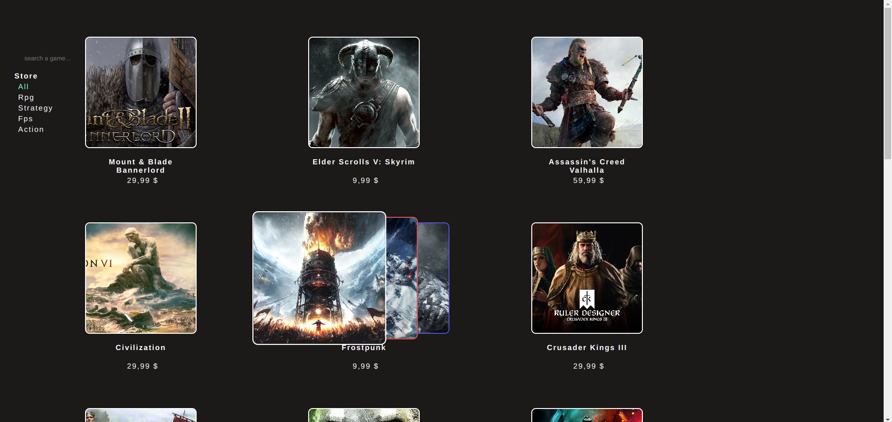
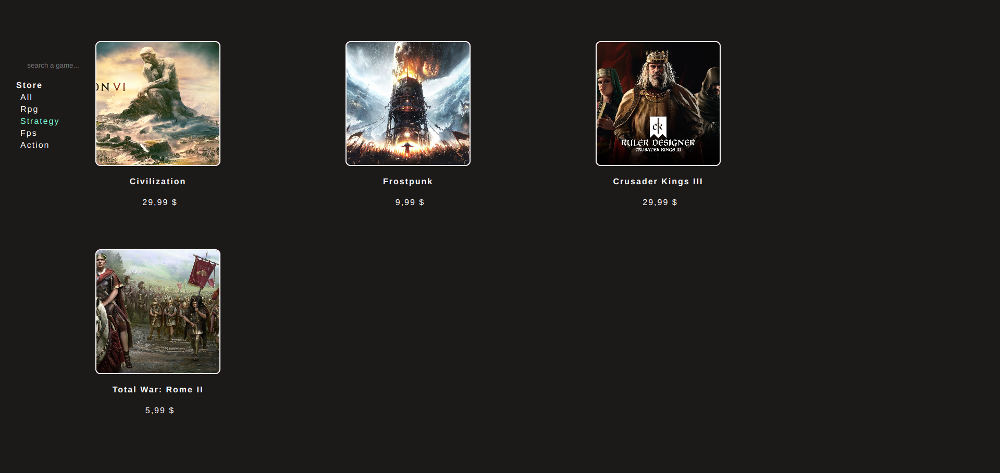
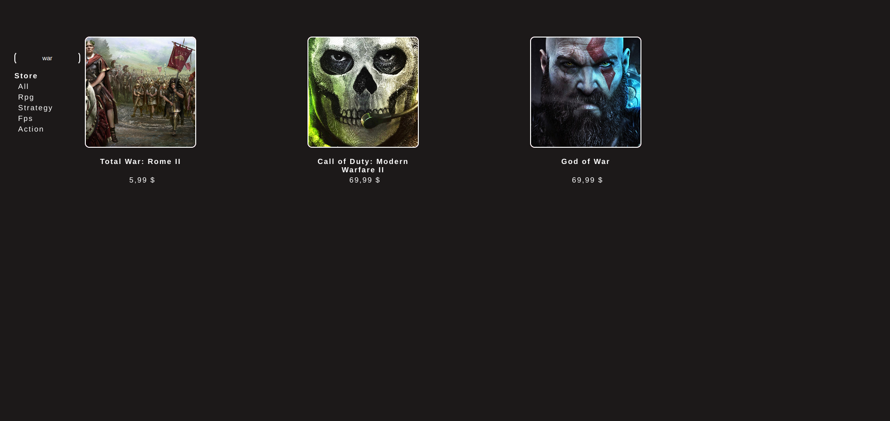

# FILTER PROJECT

## FULLSTACK PRACTICE PROJECT NO: 1

1. A fullstack version of my previous frontend project to practice my skills using Javascript, NodeJS, ExpressJS, HTML, CSS.

2. There are games which are seperated by category.

3. On mouse over we can see some of their photos.

4. When we write letters on search bar, app gets the proper games without any selected category from all games.
